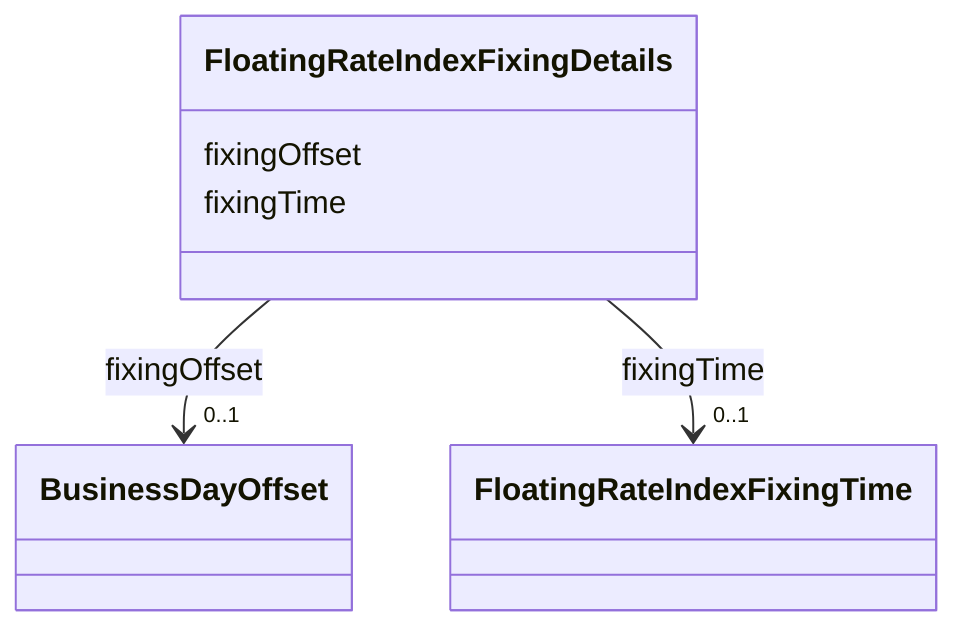

```mermaid
 classDiagram
    class FloatingRateIndexFixingDetails
    click FloatingRateIndexFixingDetails href "../FloatingRateIndexFixingDetails"
      FloatingRateIndexFixingDetails : fixingOffset
        
          
    
        
        
        FloatingRateIndexFixingDetails --> "0..1" BusinessDayOffset : fixingOffset
        click BusinessDayOffset href "../BusinessDayOffset"
    

        
      FloatingRateIndexFixingDetails : fixingTime
        
          
    
        
        
        FloatingRateIndexFixingDetails --> "0..1" FloatingRateIndexFixingTime : fixingTime
        click FloatingRateIndexFixingTime href "../FloatingRateIndexFixingTime"
    

        
      
```
