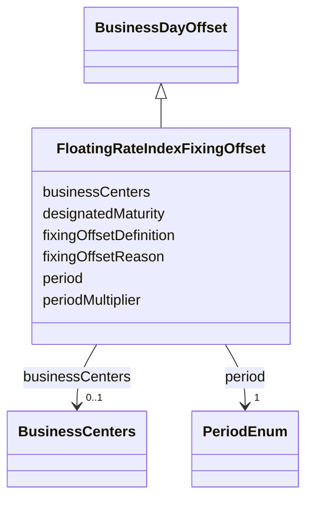

```mermaid
 classDiagram
    class FloatingRateIndexFixingOffset
    click FloatingRateIndexFixingOffset href "../FloatingRateIndexFixingOffset"
      BusinessDayOffset <|-- FloatingRateIndexFixingOffset
        click BusinessDayOffset href "../BusinessDayOffset"
      
      FloatingRateIndexFixingOffset : businessCenters
        
          
    
        
        
        FloatingRateIndexFixingOffset --> "0..1" BusinessCenters : businessCenters
        click BusinessCenters href "../BusinessCenters"
    

        
      FloatingRateIndexFixingOffset : designatedMaturity
        
      FloatingRateIndexFixingOffset : fixingOffsetDefinition
        
      FloatingRateIndexFixingOffset : fixingOffsetReason
        
      FloatingRateIndexFixingOffset : period
        
          
    
        
        
        FloatingRateIndexFixingOffset --> "1" PeriodEnum : period
        click PeriodEnum href "../PeriodEnum"
    

        
      FloatingRateIndexFixingOffset : periodMultiplier
        
      
```
