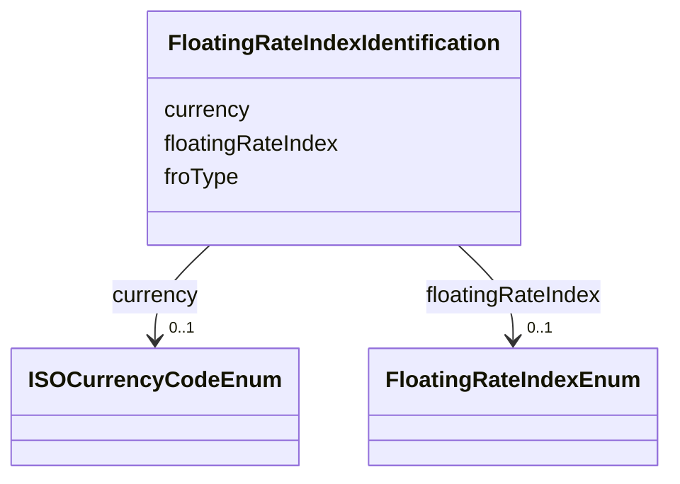

```mermaid
 classDiagram
    class FloatingRateIndexIdentification
    click FloatingRateIndexIdentification href "../FloatingRateIndexIdentification"
      FloatingRateIndexIdentification : currency
        
          
    
        
        
        FloatingRateIndexIdentification --> "0..1" ISOCurrencyCodeEnum : currency
        click ISOCurrencyCodeEnum href "../ISOCurrencyCodeEnum"
    

        
      FloatingRateIndexIdentification : floatingRateIndex
        
          
    
        
        
        FloatingRateIndexIdentification --> "0..1" FloatingRateIndexEnum : floatingRateIndex
        click FloatingRateIndexEnum href "../FloatingRateIndexEnum"
    

        
      FloatingRateIndexIdentification : froType
        
      
```
