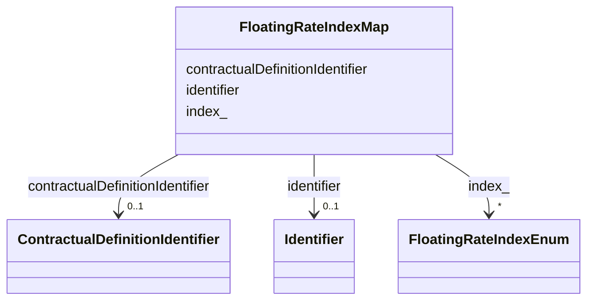

```mermaid
 classDiagram
    class FloatingRateIndexMap
    click FloatingRateIndexMap href "../FloatingRateIndexMap"
      FloatingRateIndexMap : contractualDefinitionIdentifier
        
          
    
        
        
        FloatingRateIndexMap --> "0..1" ContractualDefinitionIdentifier : contractualDefinitionIdentifier
        click ContractualDefinitionIdentifier href "../ContractualDefinitionIdentifier"
    

        
      FloatingRateIndexMap : identifier
        
          
    
        
        
        FloatingRateIndexMap --> "0..1" Identifier : identifier
        click Identifier href "../Identifier"
    

        
      FloatingRateIndexMap : index_
        
          
    
        
        
        FloatingRateIndexMap --> "*" FloatingRateIndexEnum : index_
        click FloatingRateIndexEnum href "../FloatingRateIndexEnum"
    

        
      
```
