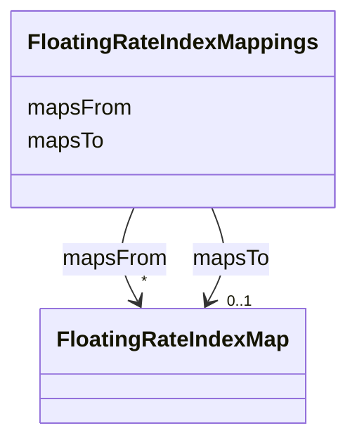

```mermaid
 classDiagram
    class FloatingRateIndexMappings
    click FloatingRateIndexMappings href "../FloatingRateIndexMappings"
      FloatingRateIndexMappings : mapsFrom
        
          
    
        
        
        FloatingRateIndexMappings --> "*" FloatingRateIndexMap : mapsFrom
        click FloatingRateIndexMap href "../FloatingRateIndexMap"
    

        
      FloatingRateIndexMappings : mapsTo
        
          
    
        
        
        FloatingRateIndexMappings --> "0..1" FloatingRateIndexMap : mapsTo
        click FloatingRateIndexMap href "../FloatingRateIndexMap"
    

        
      
```
