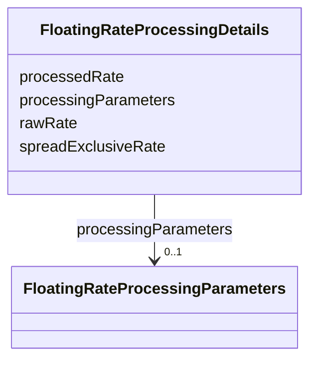

```mermaid
 classDiagram
    class FloatingRateProcessingDetails
    click FloatingRateProcessingDetails href "../FloatingRateProcessingDetails"
      FloatingRateProcessingDetails : processedRate
        
      FloatingRateProcessingDetails : processingParameters
        
          
    
        
        
        FloatingRateProcessingDetails --> "0..1" FloatingRateProcessingParameters : processingParameters
        click FloatingRateProcessingParameters href "../FloatingRateProcessingParameters"
    

        
      FloatingRateProcessingDetails : rawRate
        
      FloatingRateProcessingDetails : spreadExclusiveRate
        
      
```
