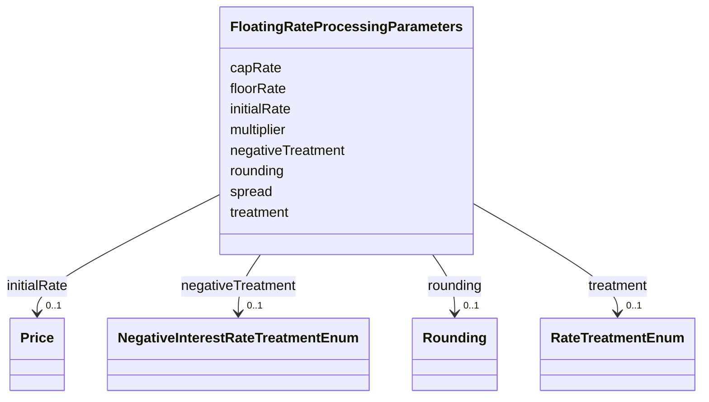

```mermaid
 classDiagram
    class FloatingRateProcessingParameters
    click FloatingRateProcessingParameters href "../FloatingRateProcessingParameters"
      FloatingRateProcessingParameters : capRate
        
      FloatingRateProcessingParameters : floorRate
        
      FloatingRateProcessingParameters : initialRate
        
          
    
        
        
        FloatingRateProcessingParameters --> "0..1" Price : initialRate
        click Price href "../Price"
    

        
      FloatingRateProcessingParameters : multiplier
        
      FloatingRateProcessingParameters : negativeTreatment
        
          
    
        
        
        FloatingRateProcessingParameters --> "0..1" NegativeInterestRateTreatmentEnum : negativeTreatment
        click NegativeInterestRateTreatmentEnum href "../NegativeInterestRateTreatmentEnum"
    

        
      FloatingRateProcessingParameters : rounding
        
          
    
        
        
        FloatingRateProcessingParameters --> "0..1" Rounding : rounding
        click Rounding href "../Rounding"
    

        
      FloatingRateProcessingParameters : spread
        
      FloatingRateProcessingParameters : treatment
        
          
    
        
        
        FloatingRateProcessingParameters --> "0..1" RateTreatmentEnum : treatment
        click RateTreatmentEnum href "../RateTreatmentEnum"
    

        
      
```
