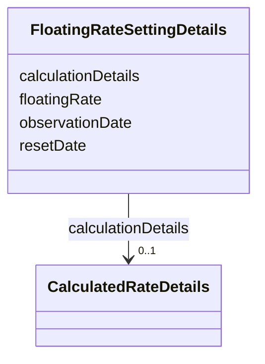

```mermaid
 classDiagram
    class FloatingRateSettingDetails
    click FloatingRateSettingDetails href "../FloatingRateSettingDetails"
      FloatingRateSettingDetails : calculationDetails
        
          
    
        
        
        FloatingRateSettingDetails --> "0..1" CalculatedRateDetails : calculationDetails
        click CalculatedRateDetails href "../CalculatedRateDetails"
    

        
      FloatingRateSettingDetails : floatingRate
        
      FloatingRateSettingDetails : observationDate
        
      FloatingRateSettingDetails : resetDate
        
      
```
