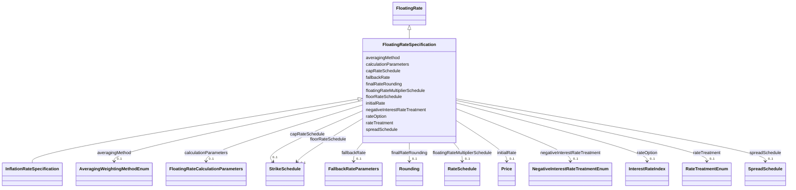

```mermaid
 classDiagram
    class FloatingRateSpecification
    click FloatingRateSpecification href "../FloatingRateSpecification"
      FloatingRate <|-- FloatingRateSpecification
        click FloatingRate href "../FloatingRate"
      

      FloatingRateSpecification <|-- InflationRateSpecification
        click InflationRateSpecification href "../InflationRateSpecification"
      

      FloatingRateSpecification : averagingMethod
        
          
    
        
        
        FloatingRateSpecification --> "0..1" AveragingWeightingMethodEnum : averagingMethod
        click AveragingWeightingMethodEnum href "../AveragingWeightingMethodEnum"
    

        
      FloatingRateSpecification : calculationParameters
        
          
    
        
        
        FloatingRateSpecification --> "0..1" FloatingRateCalculationParameters : calculationParameters
        click FloatingRateCalculationParameters href "../FloatingRateCalculationParameters"
    

        
      FloatingRateSpecification : capRateSchedule
        
          
    
        
        
        FloatingRateSpecification --> "0..1" StrikeSchedule : capRateSchedule
        click StrikeSchedule href "../StrikeSchedule"
    

        
      FloatingRateSpecification : fallbackRate
        
          
    
        
        
        FloatingRateSpecification --> "0..1" FallbackRateParameters : fallbackRate
        click FallbackRateParameters href "../FallbackRateParameters"
    

        
      FloatingRateSpecification : finalRateRounding
        
          
    
        
        
        FloatingRateSpecification --> "0..1" Rounding : finalRateRounding
        click Rounding href "../Rounding"
    

        
      FloatingRateSpecification : floatingRateMultiplierSchedule
        
          
    
        
        
        FloatingRateSpecification --> "0..1" RateSchedule : floatingRateMultiplierSchedule
        click RateSchedule href "../RateSchedule"
    

        
      FloatingRateSpecification : floorRateSchedule
        
          
    
        
        
        FloatingRateSpecification --> "0..1" StrikeSchedule : floorRateSchedule
        click StrikeSchedule href "../StrikeSchedule"
    

        
      FloatingRateSpecification : initialRate
        
          
    
        
        
        FloatingRateSpecification --> "0..1" Price : initialRate
        click Price href "../Price"
    

        
      FloatingRateSpecification : negativeInterestRateTreatment
        
          
    
        
        
        FloatingRateSpecification --> "0..1" NegativeInterestRateTreatmentEnum : negativeInterestRateTreatment
        click NegativeInterestRateTreatmentEnum href "../NegativeInterestRateTreatmentEnum"
    

        
      FloatingRateSpecification : rateOption
        
          
    
        
        
        FloatingRateSpecification --> "0..1" InterestRateIndex : rateOption
        click InterestRateIndex href "../InterestRateIndex"
    

        
      FloatingRateSpecification : rateTreatment
        
          
    
        
        
        FloatingRateSpecification --> "0..1" RateTreatmentEnum : rateTreatment
        click RateTreatmentEnum href "../RateTreatmentEnum"
    

        
      FloatingRateSpecification : spreadSchedule
        
          
    
        
        
        FloatingRateSpecification --> "0..1" SpreadSchedule : spreadSchedule
        click SpreadSchedule href "../SpreadSchedule"
    

        
      
```
