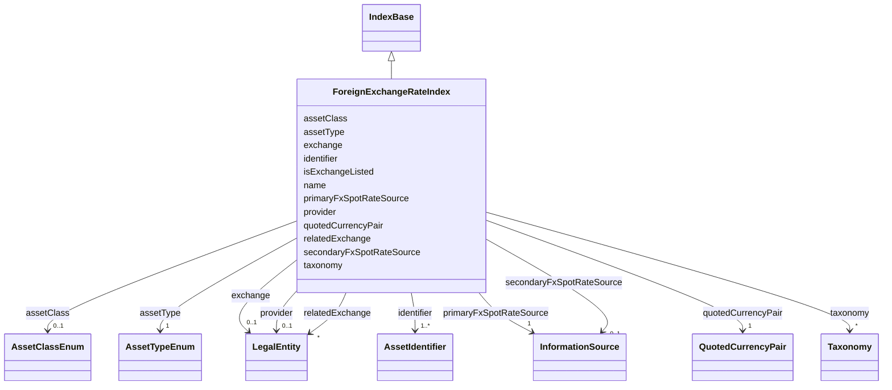

```mermaid
 classDiagram
    class ForeignExchangeRateIndex
    click ForeignExchangeRateIndex href "../ForeignExchangeRateIndex"
      IndexBase <|-- ForeignExchangeRateIndex
        click IndexBase href "../IndexBase"
      
      ForeignExchangeRateIndex : assetClass
        
          
    
        
        
        ForeignExchangeRateIndex --> "0..1" AssetClassEnum : assetClass
        click AssetClassEnum href "../AssetClassEnum"
    

        
      ForeignExchangeRateIndex : assetType
        
          
    
        
        
        ForeignExchangeRateIndex --> "1" AssetTypeEnum : assetType
        click AssetTypeEnum href "../AssetTypeEnum"
    

        
      ForeignExchangeRateIndex : exchange
        
          
    
        
        
        ForeignExchangeRateIndex --> "0..1" LegalEntity : exchange
        click LegalEntity href "../LegalEntity"
    

        
      ForeignExchangeRateIndex : identifier
        
          
    
        
        
        ForeignExchangeRateIndex --> "1..*" AssetIdentifier : identifier
        click AssetIdentifier href "../AssetIdentifier"
    

        
      ForeignExchangeRateIndex : isExchangeListed
        
      ForeignExchangeRateIndex : name
        
      ForeignExchangeRateIndex : primaryFxSpotRateSource
        
          
    
        
        
        ForeignExchangeRateIndex --> "1" InformationSource : primaryFxSpotRateSource
        click InformationSource href "../InformationSource"
    

        
      ForeignExchangeRateIndex : provider
        
          
    
        
        
        ForeignExchangeRateIndex --> "0..1" LegalEntity : provider
        click LegalEntity href "../LegalEntity"
    

        
      ForeignExchangeRateIndex : quotedCurrencyPair
        
          
    
        
        
        ForeignExchangeRateIndex --> "1" QuotedCurrencyPair : quotedCurrencyPair
        click QuotedCurrencyPair href "../QuotedCurrencyPair"
    

        
      ForeignExchangeRateIndex : relatedExchange
        
          
    
        
        
        ForeignExchangeRateIndex --> "*" LegalEntity : relatedExchange
        click LegalEntity href "../LegalEntity"
    

        
      ForeignExchangeRateIndex : secondaryFxSpotRateSource
        
          
    
        
        
        ForeignExchangeRateIndex --> "0..1" InformationSource : secondaryFxSpotRateSource
        click InformationSource href "../InformationSource"
    

        
      ForeignExchangeRateIndex : taxonomy
        
          
    
        
        
        ForeignExchangeRateIndex --> "*" Taxonomy : taxonomy
        click Taxonomy href "../Taxonomy"
    

        
      
```
