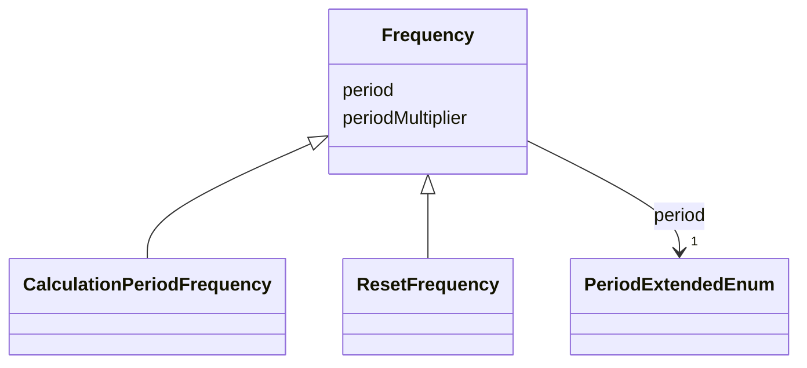

```mermaid
 classDiagram
    class Frequency
    click Frequency href "../Frequency"
      Frequency <|-- CalculationPeriodFrequency
        click CalculationPeriodFrequency href "../CalculationPeriodFrequency"
      Frequency <|-- ResetFrequency
        click ResetFrequency href "../ResetFrequency"
      
      Frequency : period
        
          
    
        
        
        Frequency --> "1" PeriodExtendedEnum : period
        click PeriodExtendedEnum href "../PeriodExtendedEnum"
    

        
      Frequency : periodMultiplier
        
      
```
