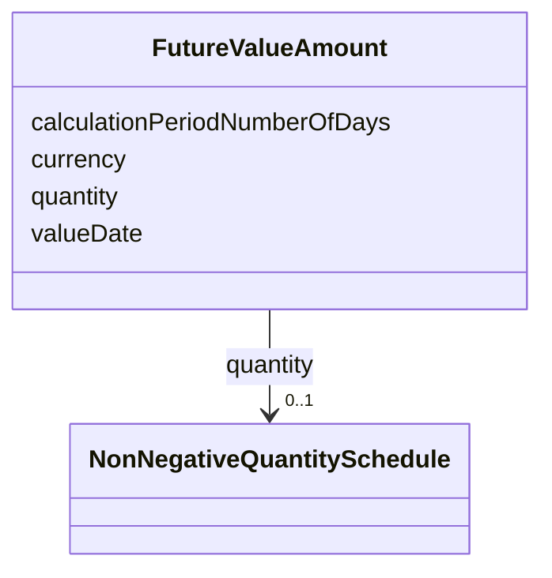

```mermaid
 classDiagram
    class FutureValueAmount
    click FutureValueAmount href "../FutureValueAmount"
      FutureValueAmount : calculationPeriodNumberOfDays
        
      FutureValueAmount : currency
        
      FutureValueAmount : quantity
        
          
    
        
        
        FutureValueAmount --> "0..1" NonNegativeQuantitySchedule : quantity
        click NonNegativeQuantitySchedule href "../NonNegativeQuantitySchedule"
    

        
      FutureValueAmount : valueDate
        
      
```
