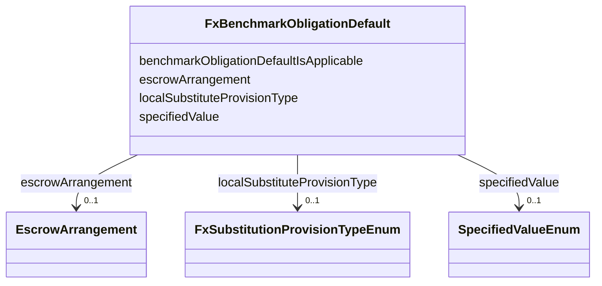

```mermaid
 classDiagram
    class FxBenchmarkObligationDefault
    click FxBenchmarkObligationDefault href "../FxBenchmarkObligationDefault"
      FxBenchmarkObligationDefault : benchmarkObligationDefaultIsApplicable
        
      FxBenchmarkObligationDefault : escrowArrangement
        
          
    
        
        
        FxBenchmarkObligationDefault --> "0..1" EscrowArrangement : escrowArrangement
        click EscrowArrangement href "../EscrowArrangement"
    

        
      FxBenchmarkObligationDefault : localSubstituteProvisionType
        
          
    
        
        
        FxBenchmarkObligationDefault --> "0..1" FxSubstitutionProvisionTypeEnum : localSubstituteProvisionType
        click FxSubstitutionProvisionTypeEnum href "../FxSubstitutionProvisionTypeEnum"
    

        
      FxBenchmarkObligationDefault : specifiedValue
        
          
    
        
        
        FxBenchmarkObligationDefault --> "0..1" SpecifiedValueEnum : specifiedValue
        click SpecifiedValueEnum href "../SpecifiedValueEnum"
    

        
      
```
