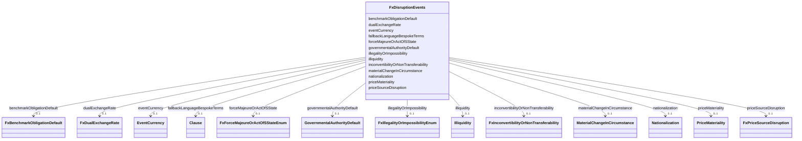

```mermaid
 classDiagram
    class FxDisruptionEvents
    click FxDisruptionEvents href "../FxDisruptionEvents"
      FxDisruptionEvents : benchmarkObligationDefault
        
          
    
        
        
        FxDisruptionEvents --> "0..1" FxBenchmarkObligationDefault : benchmarkObligationDefault
        click FxBenchmarkObligationDefault href "../FxBenchmarkObligationDefault"
    

        
      FxDisruptionEvents : dualExchangeRate
        
          
    
        
        
        FxDisruptionEvents --> "0..1" FxDualExchangeRate : dualExchangeRate
        click FxDualExchangeRate href "../FxDualExchangeRate"
    

        
      FxDisruptionEvents : eventCurrency
        
          
    
        
        
        FxDisruptionEvents --> "0..1" EventCurrency : eventCurrency
        click EventCurrency href "../EventCurrency"
    

        
      FxDisruptionEvents : fallbackLanguageBespokeTerms
        
          
    
        
        
        FxDisruptionEvents --> "0..1" Clause : fallbackLanguageBespokeTerms
        click Clause href "../Clause"
    

        
      FxDisruptionEvents : forceMajeureOrActOfSState
        
          
    
        
        
        FxDisruptionEvents --> "0..1" FxForceMajeureOrActOfSStateEnum : forceMajeureOrActOfSState
        click FxForceMajeureOrActOfSStateEnum href "../FxForceMajeureOrActOfSStateEnum"
    

        
      FxDisruptionEvents : governmentalAuthorityDefault
        
          
    
        
        
        FxDisruptionEvents --> "0..1" GovernmentalAuthorityDefault : governmentalAuthorityDefault
        click GovernmentalAuthorityDefault href "../GovernmentalAuthorityDefault"
    

        
      FxDisruptionEvents : illegalityOrImpossibility
        
          
    
        
        
        FxDisruptionEvents --> "0..1" FxIllegalityOrImpossibilityEnum : illegalityOrImpossibility
        click FxIllegalityOrImpossibilityEnum href "../FxIllegalityOrImpossibilityEnum"
    

        
      FxDisruptionEvents : illiquidity
        
          
    
        
        
        FxDisruptionEvents --> "0..1" Illiquidity : illiquidity
        click Illiquidity href "../Illiquidity"
    

        
      FxDisruptionEvents : inconvertibilityOrNonTransferability
        
          
    
        
        
        FxDisruptionEvents --> "0..1" FxInconvertibilityOrNonTransferability : inconvertibilityOrNonTransferability
        click FxInconvertibilityOrNonTransferability href "../FxInconvertibilityOrNonTransferability"
    

        
      FxDisruptionEvents : materialChangeInCircumstance
        
          
    
        
        
        FxDisruptionEvents --> "0..1" MaterialChangeInCircumstance : materialChangeInCircumstance
        click MaterialChangeInCircumstance href "../MaterialChangeInCircumstance"
    

        
      FxDisruptionEvents : nationalization
        
          
    
        
        
        FxDisruptionEvents --> "0..1" Nationalization : nationalization
        click Nationalization href "../Nationalization"
    

        
      FxDisruptionEvents : priceMateriality
        
          
    
        
        
        FxDisruptionEvents --> "0..1" PriceMateriality : priceMateriality
        click PriceMateriality href "../PriceMateriality"
    

        
      FxDisruptionEvents : priceSourceDisruption
        
          
    
        
        
        FxDisruptionEvents --> "0..1" FxPriceSourceDisruption : priceSourceDisruption
        click FxPriceSourceDisruption href "../FxPriceSourceDisruption"
    

        
      
```
