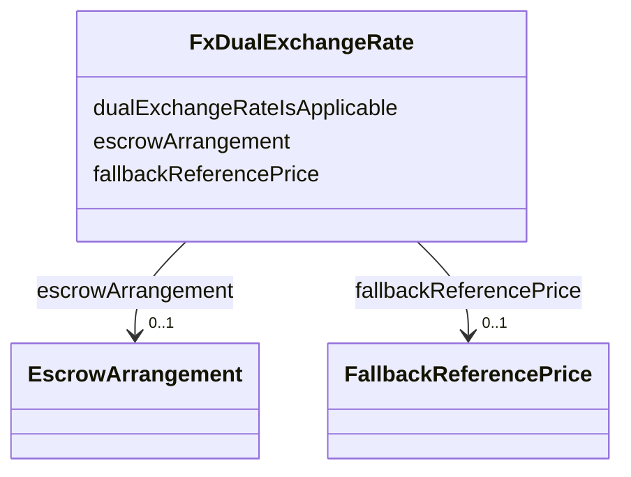

```mermaid
 classDiagram
    class FxDualExchangeRate
    click FxDualExchangeRate href "../FxDualExchangeRate"
      FxDualExchangeRate : dualExchangeRateIsApplicable
        
      FxDualExchangeRate : escrowArrangement
        
          
    
        
        
        FxDualExchangeRate --> "0..1" EscrowArrangement : escrowArrangement
        click EscrowArrangement href "../EscrowArrangement"
    

        
      FxDualExchangeRate : fallbackReferencePrice
        
          
    
        
        
        FxDualExchangeRate --> "0..1" FallbackReferencePrice : fallbackReferencePrice
        click FallbackReferencePrice href "../FallbackReferencePrice"
    

        
      
```
