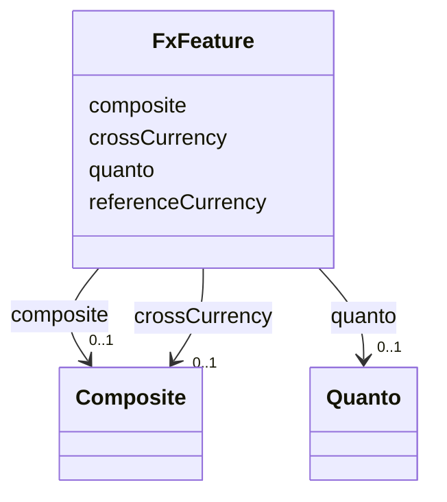

```mermaid
 classDiagram
    class FxFeature
    click FxFeature href "../FxFeature"
      FxFeature : composite
        
          
    
        
        
        FxFeature --> "0..1" Composite : composite
        click Composite href "../Composite"
    

        
      FxFeature : crossCurrency
        
          
    
        
        
        FxFeature --> "0..1" Composite : crossCurrency
        click Composite href "../Composite"
    

        
      FxFeature : quanto
        
          
    
        
        
        FxFeature --> "0..1" Quanto : quanto
        click Quanto href "../Quanto"
    

        
      FxFeature : referenceCurrency
        
      
```
