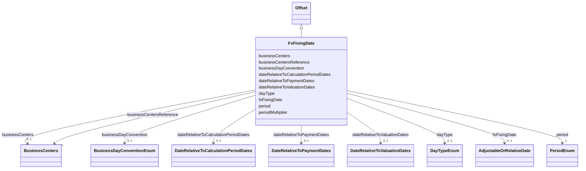

```mermaid
 classDiagram
    class FxFixingDate
    click FxFixingDate href "../FxFixingDate"
      Offset <|-- FxFixingDate
        click Offset href "../Offset"
      
      FxFixingDate : businessCenters
        
          
    
        
        
        FxFixingDate --> "0..1" BusinessCenters : businessCenters
        click BusinessCenters href "../BusinessCenters"
    

        
      FxFixingDate : businessCentersReference
        
          
    
        
        
        FxFixingDate --> "0..1" BusinessCenters : businessCentersReference
        click BusinessCenters href "../BusinessCenters"
    

        
      FxFixingDate : businessDayConvention
        
          
    
        
        
        FxFixingDate --> "0..1" BusinessDayConventionEnum : businessDayConvention
        click BusinessDayConventionEnum href "../BusinessDayConventionEnum"
    

        
      FxFixingDate : dateRelativeToCalculationPeriodDates
        
          
    
        
        
        FxFixingDate --> "0..1" DateRelativeToCalculationPeriodDates : dateRelativeToCalculationPeriodDates
        click DateRelativeToCalculationPeriodDates href "../DateRelativeToCalculationPeriodDates"
    

        
      FxFixingDate : dateRelativeToPaymentDates
        
          
    
        
        
        FxFixingDate --> "0..1" DateRelativeToPaymentDates : dateRelativeToPaymentDates
        click DateRelativeToPaymentDates href "../DateRelativeToPaymentDates"
    

        
      FxFixingDate : dateRelativeToValuationDates
        
          
    
        
        
        FxFixingDate --> "0..1" DateRelativeToValuationDates : dateRelativeToValuationDates
        click DateRelativeToValuationDates href "../DateRelativeToValuationDates"
    

        
      FxFixingDate : dayType
        
          
    
        
        
        FxFixingDate --> "0..1" DayTypeEnum : dayType
        click DayTypeEnum href "../DayTypeEnum"
    

        
      FxFixingDate : fxFixingDate
        
          
    
        
        
        FxFixingDate --> "0..1" AdjustableOrRelativeDate : fxFixingDate
        click AdjustableOrRelativeDate href "../AdjustableOrRelativeDate"
    

        
      FxFixingDate : period
        
          
    
        
        
        FxFixingDate --> "1" PeriodEnum : period
        click PeriodEnum href "../PeriodEnum"
    

        
      FxFixingDate : periodMultiplier
        
      
```
