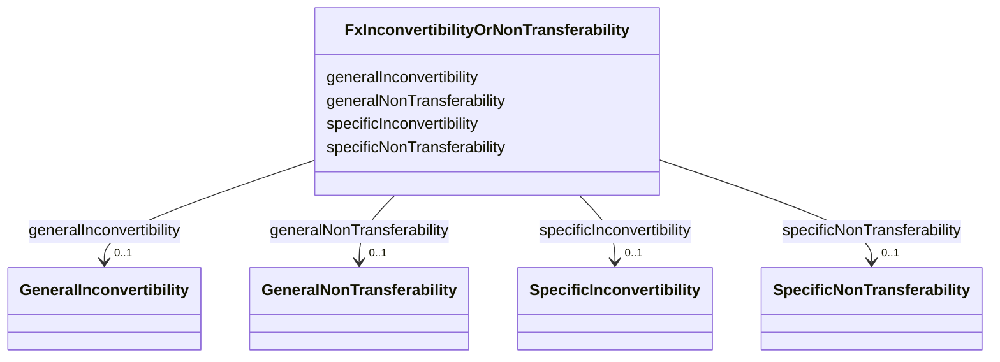

```mermaid
 classDiagram
    class FxInconvertibilityOrNonTransferability
    click FxInconvertibilityOrNonTransferability href "../FxInconvertibilityOrNonTransferability"
      FxInconvertibilityOrNonTransferability : generalInconvertibility
        
          
    
        
        
        FxInconvertibilityOrNonTransferability --> "0..1" GeneralInconvertibility : generalInconvertibility
        click GeneralInconvertibility href "../GeneralInconvertibility"
    

        
      FxInconvertibilityOrNonTransferability : generalNonTransferability
        
          
    
        
        
        FxInconvertibilityOrNonTransferability --> "0..1" GeneralNonTransferability : generalNonTransferability
        click GeneralNonTransferability href "../GeneralNonTransferability"
    

        
      FxInconvertibilityOrNonTransferability : specificInconvertibility
        
          
    
        
        
        FxInconvertibilityOrNonTransferability --> "0..1" SpecificInconvertibility : specificInconvertibility
        click SpecificInconvertibility href "../SpecificInconvertibility"
    

        
      FxInconvertibilityOrNonTransferability : specificNonTransferability
        
          
    
        
        
        FxInconvertibilityOrNonTransferability --> "0..1" SpecificNonTransferability : specificNonTransferability
        click SpecificNonTransferability href "../SpecificNonTransferability"
    

        
      
```
