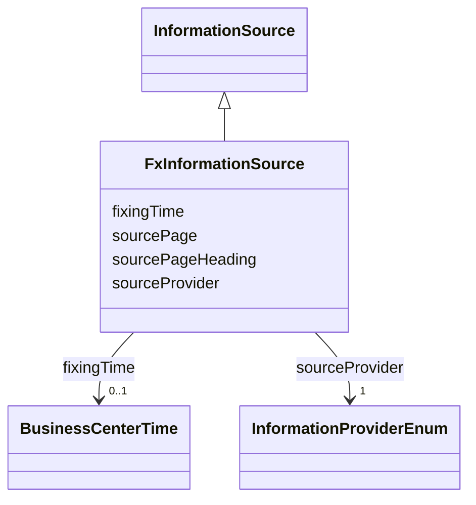

```mermaid
 classDiagram
    class FxInformationSource
    click FxInformationSource href "../FxInformationSource"
      InformationSource <|-- FxInformationSource
        click InformationSource href "../InformationSource"
      
      FxInformationSource : fixingTime
        
          
    
        
        
        FxInformationSource --> "0..1" BusinessCenterTime : fixingTime
        click BusinessCenterTime href "../BusinessCenterTime"
    

        
      FxInformationSource : sourcePage
        
      FxInformationSource : sourcePageHeading
        
      FxInformationSource : sourceProvider
        
          
    
        
        
        FxInformationSource --> "1" InformationProviderEnum : sourceProvider
        click InformationProviderEnum href "../InformationProviderEnum"
    

        
      
```
