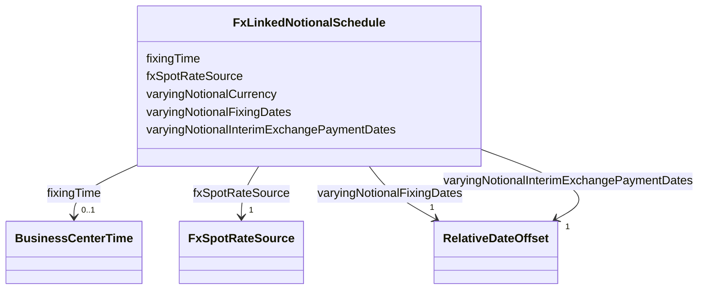

```mermaid
 classDiagram
    class FxLinkedNotionalSchedule
    click FxLinkedNotionalSchedule href "../FxLinkedNotionalSchedule"
      FxLinkedNotionalSchedule : fixingTime
        
          
    
        
        
        FxLinkedNotionalSchedule --> "0..1" BusinessCenterTime : fixingTime
        click BusinessCenterTime href "../BusinessCenterTime"
    

        
      FxLinkedNotionalSchedule : fxSpotRateSource
        
          
    
        
        
        FxLinkedNotionalSchedule --> "1" FxSpotRateSource : fxSpotRateSource
        click FxSpotRateSource href "../FxSpotRateSource"
    

        
      FxLinkedNotionalSchedule : varyingNotionalCurrency
        
      FxLinkedNotionalSchedule : varyingNotionalFixingDates
        
          
    
        
        
        FxLinkedNotionalSchedule --> "1" RelativeDateOffset : varyingNotionalFixingDates
        click RelativeDateOffset href "../RelativeDateOffset"
    

        
      FxLinkedNotionalSchedule : varyingNotionalInterimExchangePaymentDates
        
          
    
        
        
        FxLinkedNotionalSchedule --> "1" RelativeDateOffset : varyingNotionalInterimExchangePaymentDates
        click RelativeDateOffset href "../RelativeDateOffset"
    

        
      
```
