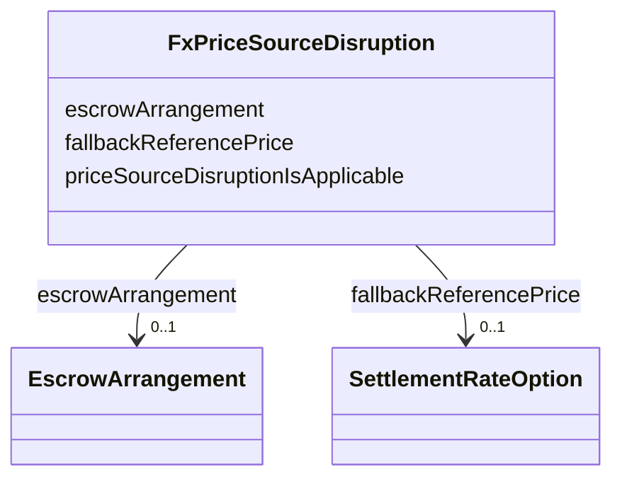

```mermaid
 classDiagram
    class FxPriceSourceDisruption
    click FxPriceSourceDisruption href "../FxPriceSourceDisruption"
      FxPriceSourceDisruption : escrowArrangement
        
          
    
        
        
        FxPriceSourceDisruption --> "0..1" EscrowArrangement : escrowArrangement
        click EscrowArrangement href "../EscrowArrangement"
    

        
      FxPriceSourceDisruption : fallbackReferencePrice
        
          
    
        
        
        FxPriceSourceDisruption --> "0..1" SettlementRateOption : fallbackReferencePrice
        click SettlementRateOption href "../SettlementRateOption"
    

        
      FxPriceSourceDisruption : priceSourceDisruptionIsApplicable
        
      
```
