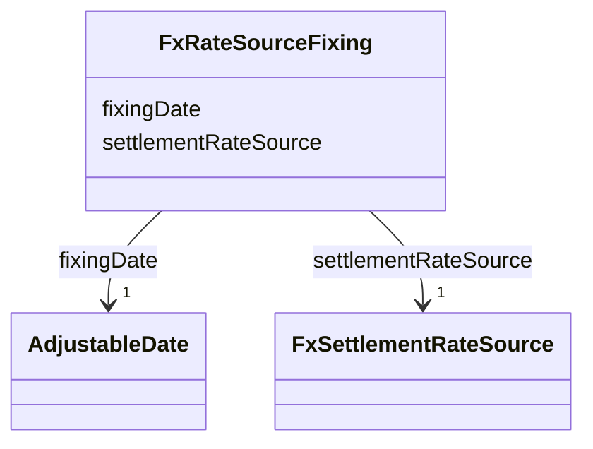

```mermaid
 classDiagram
    class FxRateSourceFixing
    click FxRateSourceFixing href "../FxRateSourceFixing"
      FxRateSourceFixing : fixingDate
        
          
    
        
        
        FxRateSourceFixing --> "1" AdjustableDate : fixingDate
        click AdjustableDate href "../AdjustableDate"
    

        
      FxRateSourceFixing : settlementRateSource
        
          
    
        
        
        FxRateSourceFixing --> "1" FxSettlementRateSource : settlementRateSource
        click FxSettlementRateSource href "../FxSettlementRateSource"
    

        
      
```
