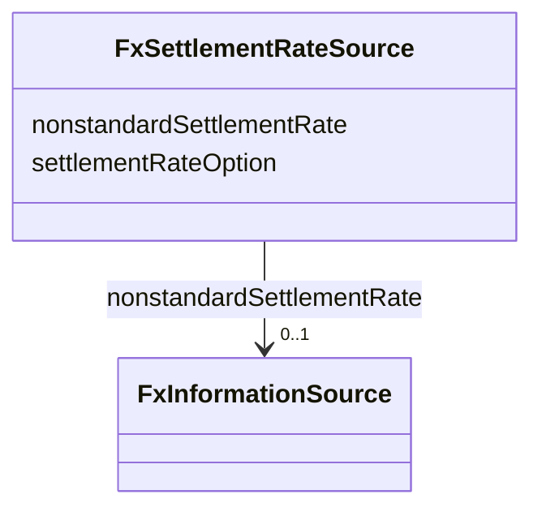

```mermaid
 classDiagram
    class FxSettlementRateSource
    click FxSettlementRateSource href "../FxSettlementRateSource"
      FxSettlementRateSource : nonstandardSettlementRate
        
          
    
        
        
        FxSettlementRateSource --> "0..1" FxInformationSource : nonstandardSettlementRate
        click FxInformationSource href "../FxInformationSource"
    

        
      FxSettlementRateSource : settlementRateOption
        
      
```
