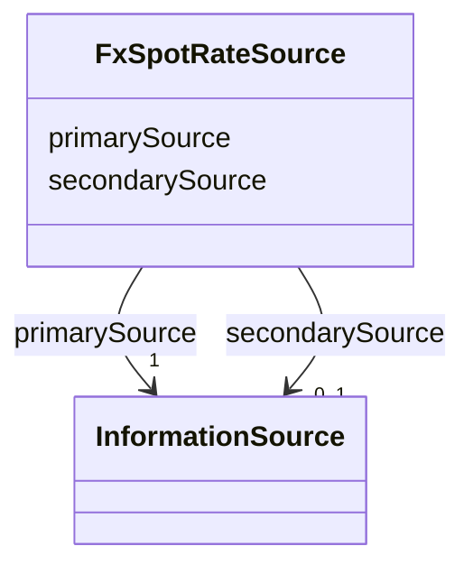

```mermaid
 classDiagram
    class FxSpotRateSource
    click FxSpotRateSource href "../FxSpotRateSource"
      FxSpotRateSource : primarySource
        
          
    
        
        
        FxSpotRateSource --> "1" InformationSource : primarySource
        click InformationSource href "../InformationSource"
    

        
      FxSpotRateSource : secondarySource
        
          
    
        
        
        FxSpotRateSource --> "0..1" InformationSource : secondarySource
        click InformationSource href "../InformationSource"
    

        
      
```
