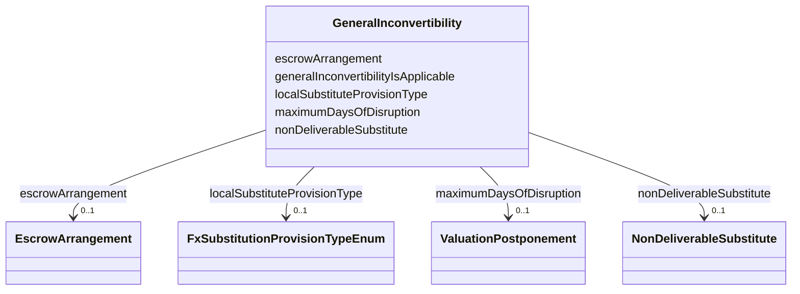

```mermaid
 classDiagram
    class GeneralInconvertibility
    click GeneralInconvertibility href "../GeneralInconvertibility"
      GeneralInconvertibility : escrowArrangement
        
          
    
        
        
        GeneralInconvertibility --> "0..1" EscrowArrangement : escrowArrangement
        click EscrowArrangement href "../EscrowArrangement"
    

        
      GeneralInconvertibility : generalInconvertibilityIsApplicable
        
      GeneralInconvertibility : localSubstituteProvisionType
        
          
    
        
        
        GeneralInconvertibility --> "0..1" FxSubstitutionProvisionTypeEnum : localSubstituteProvisionType
        click FxSubstitutionProvisionTypeEnum href "../FxSubstitutionProvisionTypeEnum"
    

        
      GeneralInconvertibility : maximumDaysOfDisruption
        
          
    
        
        
        GeneralInconvertibility --> "0..1" ValuationPostponement : maximumDaysOfDisruption
        click ValuationPostponement href "../ValuationPostponement"
    

        
      GeneralInconvertibility : nonDeliverableSubstitute
        
          
    
        
        
        GeneralInconvertibility --> "0..1" NonDeliverableSubstitute : nonDeliverableSubstitute
        click NonDeliverableSubstitute href "../NonDeliverableSubstitute"
    

        
      
```
