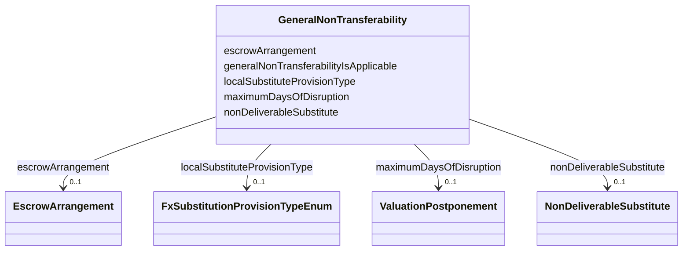

```mermaid
 classDiagram
    class GeneralNonTransferability
    click GeneralNonTransferability href "../GeneralNonTransferability"
      GeneralNonTransferability : escrowArrangement
        
          
    
        
        
        GeneralNonTransferability --> "0..1" EscrowArrangement : escrowArrangement
        click EscrowArrangement href "../EscrowArrangement"
    

        
      GeneralNonTransferability : generalNonTransferabilityIsApplicable
        
      GeneralNonTransferability : localSubstituteProvisionType
        
          
    
        
        
        GeneralNonTransferability --> "0..1" FxSubstitutionProvisionTypeEnum : localSubstituteProvisionType
        click FxSubstitutionProvisionTypeEnum href "../FxSubstitutionProvisionTypeEnum"
    

        
      GeneralNonTransferability : maximumDaysOfDisruption
        
          
    
        
        
        GeneralNonTransferability --> "0..1" ValuationPostponement : maximumDaysOfDisruption
        click ValuationPostponement href "../ValuationPostponement"
    

        
      GeneralNonTransferability : nonDeliverableSubstitute
        
          
    
        
        
        GeneralNonTransferability --> "0..1" NonDeliverableSubstitute : nonDeliverableSubstitute
        click NonDeliverableSubstitute href "../NonDeliverableSubstitute"
    

        
      
```
