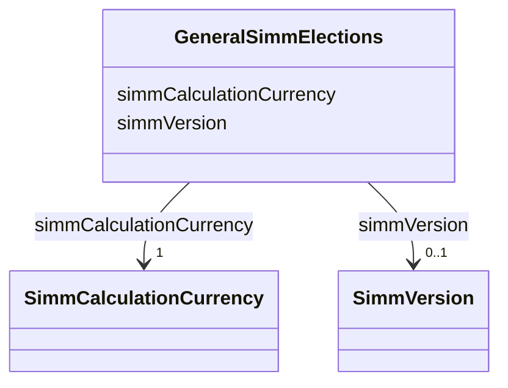

```mermaid
 classDiagram
    class GeneralSimmElections
    click GeneralSimmElections href "../GeneralSimmElections"
      GeneralSimmElections : simmCalculationCurrency
        
          
    
        
        
        GeneralSimmElections --> "1" SimmCalculationCurrency : simmCalculationCurrency
        click SimmCalculationCurrency href "../SimmCalculationCurrency"
    

        
      GeneralSimmElections : simmVersion
        
          
    
        
        
        GeneralSimmElections --> "0..1" SimmVersion : simmVersion
        click SimmVersion href "../SimmVersion"
    

        
      
```
