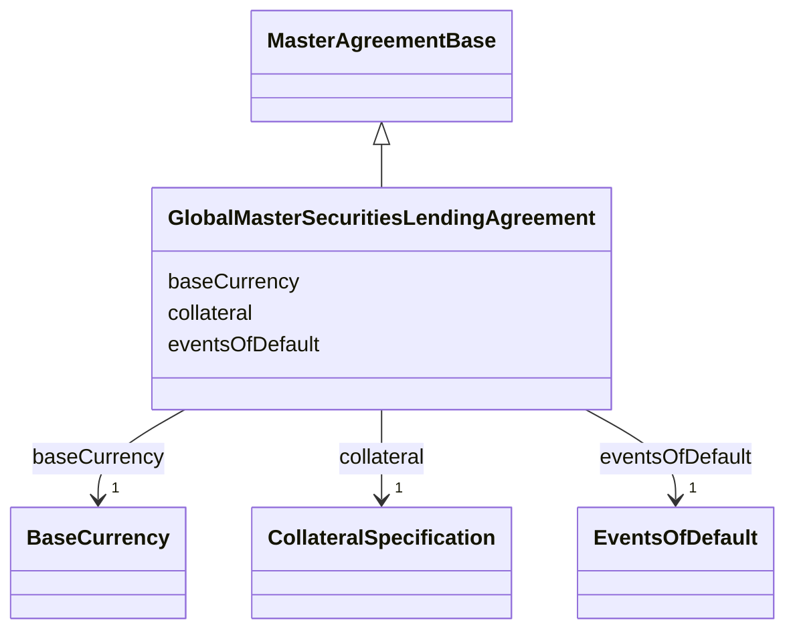

```mermaid
 classDiagram
    class GlobalMasterSecuritiesLendingAgreement
    click GlobalMasterSecuritiesLendingAgreement href "../GlobalMasterSecuritiesLendingAgreement"
      MasterAgreementBase <|-- GlobalMasterSecuritiesLendingAgreement
        click MasterAgreementBase href "../MasterAgreementBase"
      
      GlobalMasterSecuritiesLendingAgreement : baseCurrency
        
          
    
        
        
        GlobalMasterSecuritiesLendingAgreement --> "1" BaseCurrency : baseCurrency
        click BaseCurrency href "../BaseCurrency"
    

        
      GlobalMasterSecuritiesLendingAgreement : collateral
        
          
    
        
        
        GlobalMasterSecuritiesLendingAgreement --> "1" CollateralSpecification : collateral
        click CollateralSpecification href "../CollateralSpecification"
    

        
      GlobalMasterSecuritiesLendingAgreement : eventsOfDefault
        
          
    
        
        
        GlobalMasterSecuritiesLendingAgreement --> "1" EventsOfDefault : eventsOfDefault
        click EventsOfDefault href "../EventsOfDefault"
    

        
      
```
