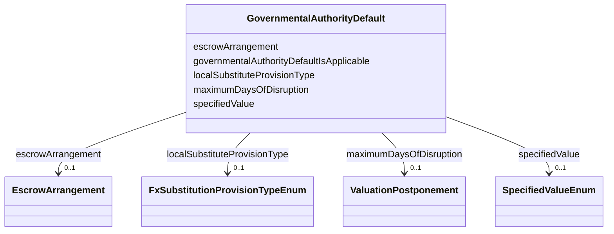

```mermaid
 classDiagram
    class GovernmentalAuthorityDefault
    click GovernmentalAuthorityDefault href "../GovernmentalAuthorityDefault"
      GovernmentalAuthorityDefault : escrowArrangement
        
          
    
        
        
        GovernmentalAuthorityDefault --> "0..1" EscrowArrangement : escrowArrangement
        click EscrowArrangement href "../EscrowArrangement"
    

        
      GovernmentalAuthorityDefault : governmentalAuthorityDefaultIsApplicable
        
      GovernmentalAuthorityDefault : localSubstituteProvisionType
        
          
    
        
        
        GovernmentalAuthorityDefault --> "0..1" FxSubstitutionProvisionTypeEnum : localSubstituteProvisionType
        click FxSubstitutionProvisionTypeEnum href "../FxSubstitutionProvisionTypeEnum"
    

        
      GovernmentalAuthorityDefault : maximumDaysOfDisruption
        
          
    
        
        
        GovernmentalAuthorityDefault --> "0..1" ValuationPostponement : maximumDaysOfDisruption
        click ValuationPostponement href "../ValuationPostponement"
    

        
      GovernmentalAuthorityDefault : specifiedValue
        
          
    
        
        
        GovernmentalAuthorityDefault --> "0..1" SpecifiedValueEnum : specifiedValue
        click SpecifiedValueEnum href "../SpecifiedValueEnum"
    

        
      
```
