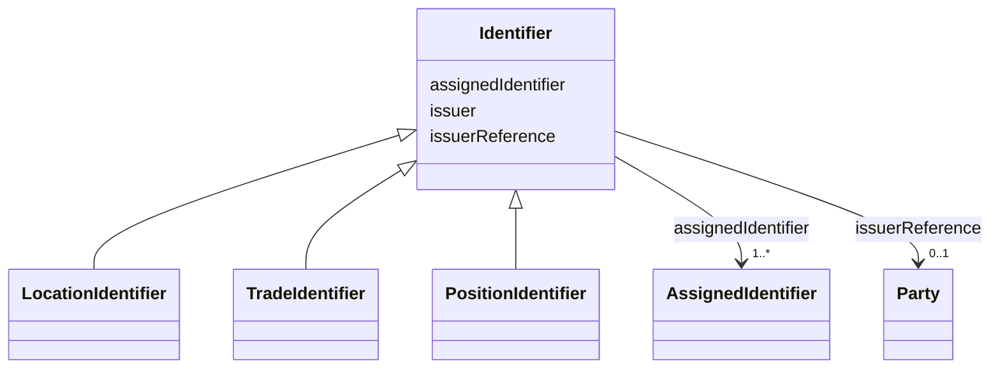

```mermaid
 classDiagram
    class Identifier
    click Identifier href "../Identifier"
      Identifier <|-- LocationIdentifier
        click LocationIdentifier href "../LocationIdentifier"
      Identifier <|-- TradeIdentifier
        click TradeIdentifier href "../TradeIdentifier"
      Identifier <|-- PositionIdentifier
        click PositionIdentifier href "../PositionIdentifier"
      
      Identifier : assignedIdentifier
        
          
    
        
        
        Identifier --> "1..*" AssignedIdentifier : assignedIdentifier
        click AssignedIdentifier href "../AssignedIdentifier"
    

        
      Identifier : issuer
        
      Identifier : issuerReference
        
          
    
        
        
        Identifier --> "0..1" Party : issuerReference
        click Party href "../Party"
    

        
      
```
