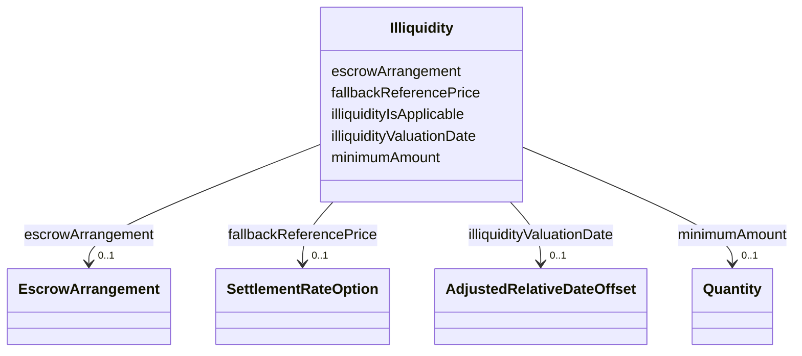

```mermaid
 classDiagram
    class Illiquidity
    click Illiquidity href "../Illiquidity"
      Illiquidity : escrowArrangement
        
          
    
        
        
        Illiquidity --> "0..1" EscrowArrangement : escrowArrangement
        click EscrowArrangement href "../EscrowArrangement"
    

        
      Illiquidity : fallbackReferencePrice
        
          
    
        
        
        Illiquidity --> "0..1" SettlementRateOption : fallbackReferencePrice
        click SettlementRateOption href "../SettlementRateOption"
    

        
      Illiquidity : illiquidityIsApplicable
        
      Illiquidity : illiquidityValuationDate
        
          
    
        
        
        Illiquidity --> "0..1" AdjustedRelativeDateOffset : illiquidityValuationDate
        click AdjustedRelativeDateOffset href "../AdjustedRelativeDateOffset"
    

        
      Illiquidity : minimumAmount
        
          
    
        
        
        Illiquidity --> "0..1" Quantity : minimumAmount
        click Quantity href "../Quantity"
    

        
      
```
