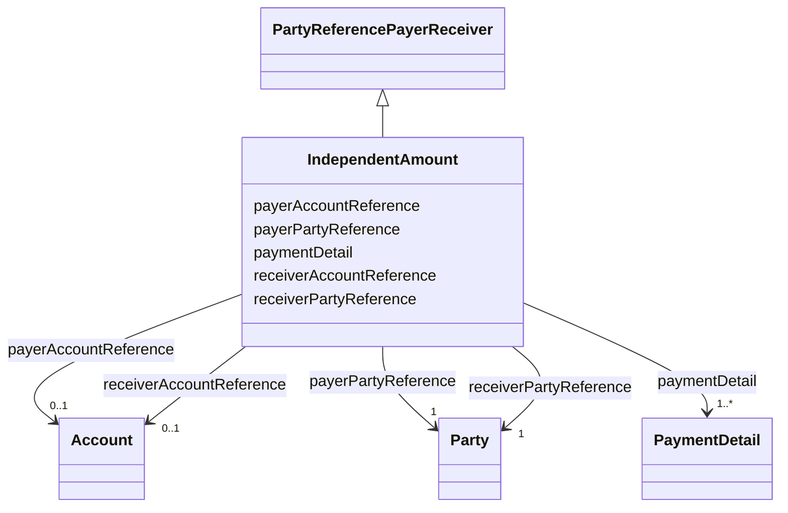

```mermaid
 classDiagram
    class IndependentAmount
    click IndependentAmount href "../IndependentAmount"
      PartyReferencePayerReceiver <|-- IndependentAmount
        click PartyReferencePayerReceiver href "../PartyReferencePayerReceiver"
      
      IndependentAmount : payerAccountReference
        
          
    
        
        
        IndependentAmount --> "0..1" Account : payerAccountReference
        click Account href "../Account"
    

        
      IndependentAmount : payerPartyReference
        
          
    
        
        
        IndependentAmount --> "1" Party : payerPartyReference
        click Party href "../Party"
    

        
      IndependentAmount : paymentDetail
        
          
    
        
        
        IndependentAmount --> "1..*" PaymentDetail : paymentDetail
        click PaymentDetail href "../PaymentDetail"
    

        
      IndependentAmount : receiverAccountReference
        
          
    
        
        
        IndependentAmount --> "0..1" Account : receiverAccountReference
        click Account href "../Account"
    

        
      IndependentAmount : receiverPartyReference
        
          
    
        
        
        IndependentAmount --> "1" Party : receiverPartyReference
        click Party href "../Party"
    

        
      
```
