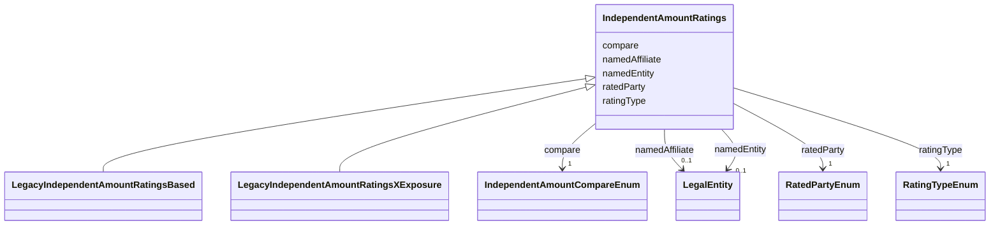

```mermaid
 classDiagram
    class IndependentAmountRatings
    click IndependentAmountRatings href "../IndependentAmountRatings"
      IndependentAmountRatings <|-- LegacyIndependentAmountRatingsBased
        click LegacyIndependentAmountRatingsBased href "../LegacyIndependentAmountRatingsBased"
      IndependentAmountRatings <|-- LegacyIndependentAmountRatingsXExposure
        click LegacyIndependentAmountRatingsXExposure href "../LegacyIndependentAmountRatingsXExposure"
      
      IndependentAmountRatings : compare
        
          
    
        
        
        IndependentAmountRatings --> "1" IndependentAmountCompareEnum : compare
        click IndependentAmountCompareEnum href "../IndependentAmountCompareEnum"
    

        
      IndependentAmountRatings : namedAffiliate
        
          
    
        
        
        IndependentAmountRatings --> "0..1" LegalEntity : namedAffiliate
        click LegalEntity href "../LegalEntity"
    

        
      IndependentAmountRatings : namedEntity
        
          
    
        
        
        IndependentAmountRatings --> "0..1" LegalEntity : namedEntity
        click LegalEntity href "../LegalEntity"
    

        
      IndependentAmountRatings : ratedParty
        
          
    
        
        
        IndependentAmountRatings --> "1" RatedPartyEnum : ratedParty
        click RatedPartyEnum href "../RatedPartyEnum"
    

        
      IndependentAmountRatings : ratingType
        
          
    
        
        
        IndependentAmountRatings --> "1" RatingTypeEnum : ratingType
        click RatingTypeEnum href "../RatingTypeEnum"
    

        
      
```
