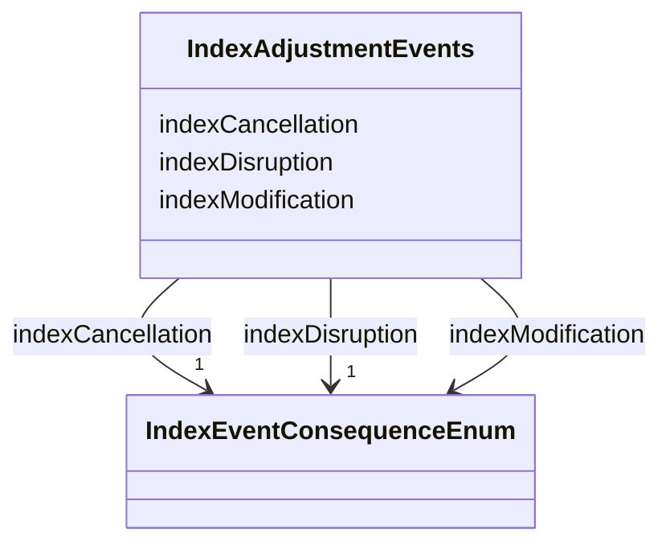

```mermaid
 classDiagram
    class IndexAdjustmentEvents
    click IndexAdjustmentEvents href "../IndexAdjustmentEvents"
      IndexAdjustmentEvents : indexCancellation
        
          
    
        
        
        IndexAdjustmentEvents --> "1" IndexEventConsequenceEnum : indexCancellation
        click IndexEventConsequenceEnum href "../IndexEventConsequenceEnum"
    

        
      IndexAdjustmentEvents : indexDisruption
        
          
    
        
        
        IndexAdjustmentEvents --> "1" IndexEventConsequenceEnum : indexDisruption
        click IndexEventConsequenceEnum href "../IndexEventConsequenceEnum"
    

        
      IndexAdjustmentEvents : indexModification
        
          
    
        
        
        IndexAdjustmentEvents --> "1" IndexEventConsequenceEnum : indexModification
        click IndexEventConsequenceEnum href "../IndexEventConsequenceEnum"
    

        
      
```
