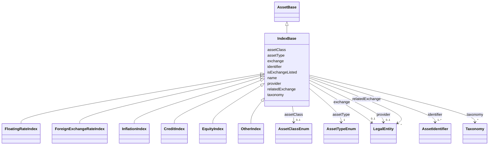

```mermaid
 classDiagram
    class IndexBase
    click IndexBase href "../IndexBase"
      AssetBase <|-- IndexBase
        click AssetBase href "../AssetBase"
      

      IndexBase <|-- FloatingRateIndex
        click FloatingRateIndex href "../FloatingRateIndex"
      IndexBase <|-- ForeignExchangeRateIndex
        click ForeignExchangeRateIndex href "../ForeignExchangeRateIndex"
      IndexBase <|-- InflationIndex
        click InflationIndex href "../InflationIndex"
      IndexBase <|-- CreditIndex
        click CreditIndex href "../CreditIndex"
      IndexBase <|-- EquityIndex
        click EquityIndex href "../EquityIndex"
      IndexBase <|-- OtherIndex
        click OtherIndex href "../OtherIndex"
      

      IndexBase : assetClass
        
          
    
        
        
        IndexBase --> "0..1" AssetClassEnum : assetClass
        click AssetClassEnum href "../AssetClassEnum"
    

        
      IndexBase : assetType
        
          
    
        
        
        IndexBase --> "1" AssetTypeEnum : assetType
        click AssetTypeEnum href "../AssetTypeEnum"
    

        
      IndexBase : exchange
        
          
    
        
        
        IndexBase --> "0..1" LegalEntity : exchange
        click LegalEntity href "../LegalEntity"
    

        
      IndexBase : identifier
        
          
    
        
        
        IndexBase --> "1..*" AssetIdentifier : identifier
        click AssetIdentifier href "../AssetIdentifier"
    

        
      IndexBase : isExchangeListed
        
      IndexBase : name
        
      IndexBase : provider
        
          
    
        
        
        IndexBase --> "0..1" LegalEntity : provider
        click LegalEntity href "../LegalEntity"
    

        
      IndexBase : relatedExchange
        
          
    
        
        
        IndexBase --> "*" LegalEntity : relatedExchange
        click LegalEntity href "../LegalEntity"
    

        
      IndexBase : taxonomy
        
          
    
        
        
        IndexBase --> "*" Taxonomy : taxonomy
        click Taxonomy href "../Taxonomy"
    

        
      
```
