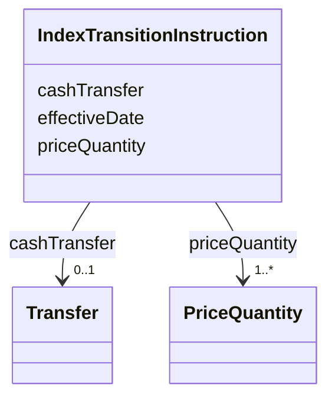

```mermaid
 classDiagram
    class IndexTransitionInstruction
    click IndexTransitionInstruction href "../IndexTransitionInstruction"
      IndexTransitionInstruction : cashTransfer
        
          
    
        
        
        IndexTransitionInstruction --> "0..1" Transfer : cashTransfer
        click Transfer href "../Transfer"
    

        
      IndexTransitionInstruction : effectiveDate
        
      IndexTransitionInstruction : priceQuantity
        
          
    
        
        
        IndexTransitionInstruction --> "1..*" PriceQuantity : priceQuantity
        click PriceQuantity href "../PriceQuantity"
    

        
      
```
