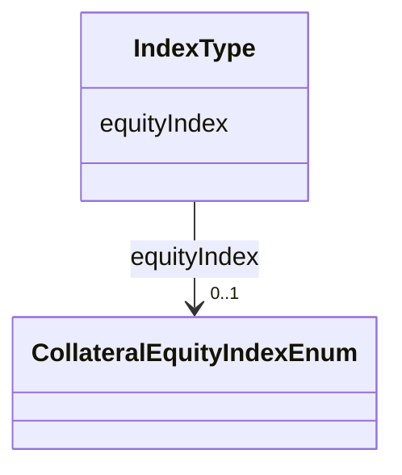

```mermaid
 classDiagram
    class IndexType
    click IndexType href "../IndexType"
      IndexType : equityIndex
        
          
    
        
        
        IndexType --> "0..1" CollateralEquityIndexEnum : equityIndex
        click CollateralEquityIndexEnum href "../CollateralEquityIndexEnum"
    

        
      
```
