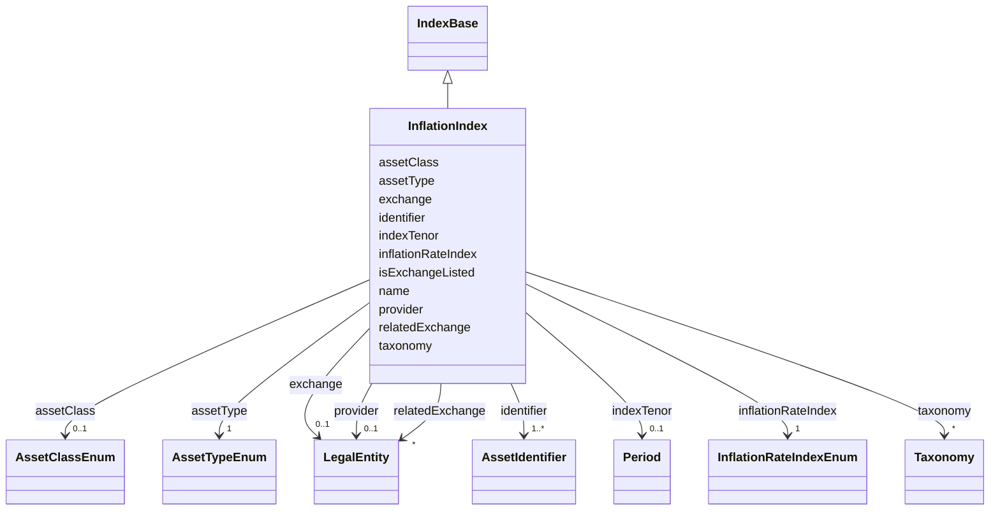

```mermaid
 classDiagram
    class InflationIndex
    click InflationIndex href "../InflationIndex"
      IndexBase <|-- InflationIndex
        click IndexBase href "../IndexBase"
      
      InflationIndex : assetClass
        
          
    
        
        
        InflationIndex --> "0..1" AssetClassEnum : assetClass
        click AssetClassEnum href "../AssetClassEnum"
    

        
      InflationIndex : assetType
        
          
    
        
        
        InflationIndex --> "1" AssetTypeEnum : assetType
        click AssetTypeEnum href "../AssetTypeEnum"
    

        
      InflationIndex : exchange
        
          
    
        
        
        InflationIndex --> "0..1" LegalEntity : exchange
        click LegalEntity href "../LegalEntity"
    

        
      InflationIndex : identifier
        
          
    
        
        
        InflationIndex --> "1..*" AssetIdentifier : identifier
        click AssetIdentifier href "../AssetIdentifier"
    

        
      InflationIndex : indexTenor
        
          
    
        
        
        InflationIndex --> "0..1" Period : indexTenor
        click Period href "../Period"
    

        
      InflationIndex : inflationRateIndex
        
          
    
        
        
        InflationIndex --> "1" InflationRateIndexEnum : inflationRateIndex
        click InflationRateIndexEnum href "../InflationRateIndexEnum"
    

        
      InflationIndex : isExchangeListed
        
      InflationIndex : name
        
      InflationIndex : provider
        
          
    
        
        
        InflationIndex --> "0..1" LegalEntity : provider
        click LegalEntity href "../LegalEntity"
    

        
      InflationIndex : relatedExchange
        
          
    
        
        
        InflationIndex --> "*" LegalEntity : relatedExchange
        click LegalEntity href "../LegalEntity"
    

        
      InflationIndex : taxonomy
        
          
    
        
        
        InflationIndex --> "*" Taxonomy : taxonomy
        click Taxonomy href "../Taxonomy"
    

        
      
```
