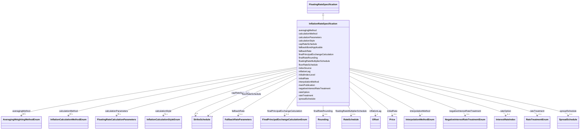

```mermaid
 classDiagram
    class InflationRateSpecification
    click InflationRateSpecification href "../InflationRateSpecification"
      FloatingRateSpecification <|-- InflationRateSpecification
        click FloatingRateSpecification href "../FloatingRateSpecification"
      
      InflationRateSpecification : averagingMethod
        
          
    
        
        
        InflationRateSpecification --> "0..1" AveragingWeightingMethodEnum : averagingMethod
        click AveragingWeightingMethodEnum href "../AveragingWeightingMethodEnum"
    

        
      InflationRateSpecification : calculationMethod
        
          
    
        
        
        InflationRateSpecification --> "0..1" InflationCalculationMethodEnum : calculationMethod
        click InflationCalculationMethodEnum href "../InflationCalculationMethodEnum"
    

        
      InflationRateSpecification : calculationParameters
        
          
    
        
        
        InflationRateSpecification --> "0..1" FloatingRateCalculationParameters : calculationParameters
        click FloatingRateCalculationParameters href "../FloatingRateCalculationParameters"
    

        
      InflationRateSpecification : calculationStyle
        
          
    
        
        
        InflationRateSpecification --> "0..1" InflationCalculationStyleEnum : calculationStyle
        click InflationCalculationStyleEnum href "../InflationCalculationStyleEnum"
    

        
      InflationRateSpecification : capRateSchedule
        
          
    
        
        
        InflationRateSpecification --> "0..1" StrikeSchedule : capRateSchedule
        click StrikeSchedule href "../StrikeSchedule"
    

        
      InflationRateSpecification : fallbackBondApplicable
        
      InflationRateSpecification : fallbackRate
        
          
    
        
        
        InflationRateSpecification --> "0..1" FallbackRateParameters : fallbackRate
        click FallbackRateParameters href "../FallbackRateParameters"
    

        
      InflationRateSpecification : finalPrincipalExchangeCalculation
        
          
    
        
        
        InflationRateSpecification --> "0..1" FinalPrincipalExchangeCalculationEnum : finalPrincipalExchangeCalculation
        click FinalPrincipalExchangeCalculationEnum href "../FinalPrincipalExchangeCalculationEnum"
    

        
      InflationRateSpecification : finalRateRounding
        
          
    
        
        
        InflationRateSpecification --> "0..1" Rounding : finalRateRounding
        click Rounding href "../Rounding"
    

        
      InflationRateSpecification : floatingRateMultiplierSchedule
        
          
    
        
        
        InflationRateSpecification --> "0..1" RateSchedule : floatingRateMultiplierSchedule
        click RateSchedule href "../RateSchedule"
    

        
      InflationRateSpecification : floorRateSchedule
        
          
    
        
        
        InflationRateSpecification --> "0..1" StrikeSchedule : floorRateSchedule
        click StrikeSchedule href "../StrikeSchedule"
    

        
      InflationRateSpecification : indexSource
        
      InflationRateSpecification : inflationLag
        
          
    
        
        
        InflationRateSpecification --> "1" Offset : inflationLag
        click Offset href "../Offset"
    

        
      InflationRateSpecification : initialIndexLevel
        
      InflationRateSpecification : initialRate
        
          
    
        
        
        InflationRateSpecification --> "0..1" Price : initialRate
        click Price href "../Price"
    

        
      InflationRateSpecification : interpolationMethod
        
          
    
        
        
        InflationRateSpecification --> "1" InterpolationMethodEnum : interpolationMethod
        click InterpolationMethodEnum href "../InterpolationMethodEnum"
    

        
      InflationRateSpecification : mainPublication
        
      InflationRateSpecification : negativeInterestRateTreatment
        
          
    
        
        
        InflationRateSpecification --> "0..1" NegativeInterestRateTreatmentEnum : negativeInterestRateTreatment
        click NegativeInterestRateTreatmentEnum href "../NegativeInterestRateTreatmentEnum"
    

        
      InflationRateSpecification : rateOption
        
          
    
        
        
        InflationRateSpecification --> "0..1" InterestRateIndex : rateOption
        click InterestRateIndex href "../InterestRateIndex"
    

        
      InflationRateSpecification : rateTreatment
        
          
    
        
        
        InflationRateSpecification --> "0..1" RateTreatmentEnum : rateTreatment
        click RateTreatmentEnum href "../RateTreatmentEnum"
    

        
      InflationRateSpecification : spreadSchedule
        
          
    
        
        
        InflationRateSpecification --> "0..1" SpreadSchedule : spreadSchedule
        click SpreadSchedule href "../SpreadSchedule"
    

        
      
```
