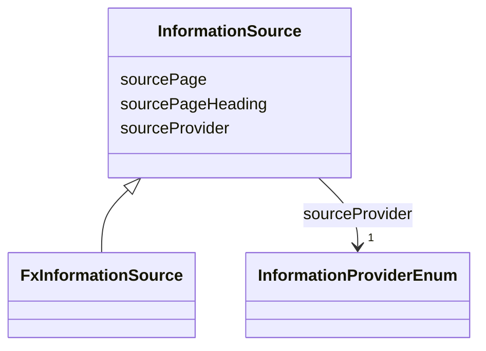

```mermaid
 classDiagram
    class InformationSource
    click InformationSource href "../InformationSource"
      InformationSource <|-- FxInformationSource
        click FxInformationSource href "../FxInformationSource"
      
      InformationSource : sourcePage
        
      InformationSource : sourcePageHeading
        
      InformationSource : sourceProvider
        
          
    
        
        
        InformationSource --> "1" InformationProviderEnum : sourceProvider
        click InformationProviderEnum href "../InformationProviderEnum"
    

        
      
```
