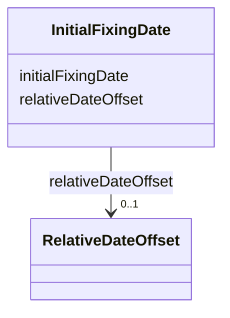

```mermaid
 classDiagram
    class InitialFixingDate
    click InitialFixingDate href "../InitialFixingDate"
      InitialFixingDate : initialFixingDate
        
      InitialFixingDate : relativeDateOffset
        
          
    
        
        
        InitialFixingDate --> "0..1" RelativeDateOffset : relativeDateOffset
        click RelativeDateOffset href "../RelativeDateOffset"
    

        
      
```
