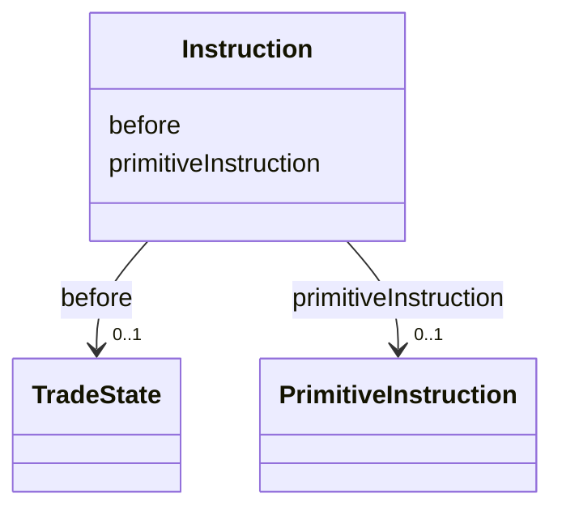

```mermaid
 classDiagram
    class Instruction
    click Instruction href "../Instruction"
      Instruction : before
        
          
    
        
        
        Instruction --> "0..1" TradeState : before
        click TradeState href "../TradeState"
    

        
      Instruction : primitiveInstruction
        
          
    
        
        
        Instruction --> "0..1" PrimitiveInstruction : primitiveInstruction
        click PrimitiveInstruction href "../PrimitiveInstruction"
    

        
      
```
