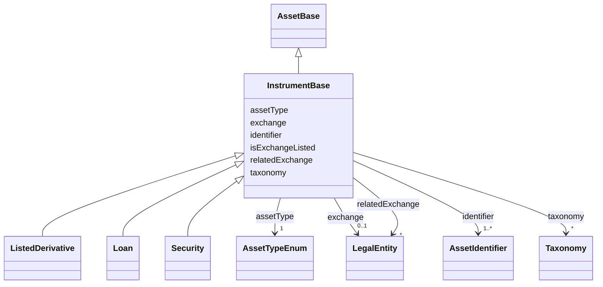

```mermaid
 classDiagram
    class InstrumentBase
    click InstrumentBase href "../InstrumentBase"
      AssetBase <|-- InstrumentBase
        click AssetBase href "../AssetBase"
      

      InstrumentBase <|-- ListedDerivative
        click ListedDerivative href "../ListedDerivative"
      InstrumentBase <|-- Loan
        click Loan href "../Loan"
      InstrumentBase <|-- Security
        click Security href "../Security"
      

      InstrumentBase : assetType
        
          
    
        
        
        InstrumentBase --> "1" AssetTypeEnum : assetType
        click AssetTypeEnum href "../AssetTypeEnum"
    

        
      InstrumentBase : exchange
        
          
    
        
        
        InstrumentBase --> "0..1" LegalEntity : exchange
        click LegalEntity href "../LegalEntity"
    

        
      InstrumentBase : identifier
        
          
    
        
        
        InstrumentBase --> "1..*" AssetIdentifier : identifier
        click AssetIdentifier href "../AssetIdentifier"
    

        
      InstrumentBase : isExchangeListed
        
      InstrumentBase : relatedExchange
        
          
    
        
        
        InstrumentBase --> "*" LegalEntity : relatedExchange
        click LegalEntity href "../LegalEntity"
    

        
      InstrumentBase : taxonomy
        
          
    
        
        
        InstrumentBase --> "*" Taxonomy : taxonomy
        click Taxonomy href "../Taxonomy"
    

        
      
```
