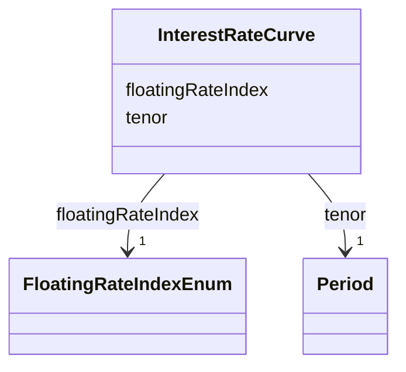

```mermaid
 classDiagram
    class InterestRateCurve
    click InterestRateCurve href "../InterestRateCurve"
      InterestRateCurve : floatingRateIndex
        
          
    
        
        
        InterestRateCurve --> "1" FloatingRateIndexEnum : floatingRateIndex
        click FloatingRateIndexEnum href "../FloatingRateIndexEnum"
    

        
      InterestRateCurve : tenor
        
          
    
        
        
        InterestRateCurve --> "1" Period : tenor
        click Period href "../Period"
    

        
      
```
