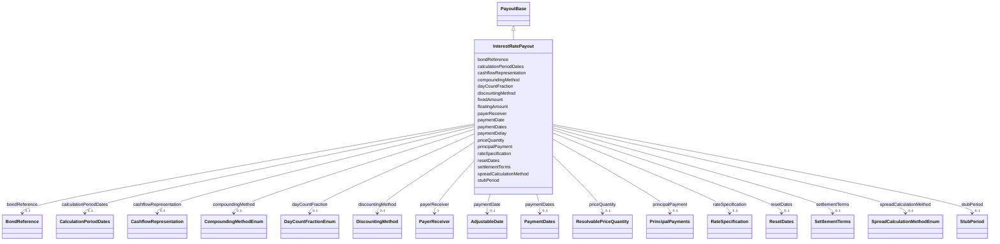

```mermaid
 classDiagram
    class InterestRatePayout
    click InterestRatePayout href "../InterestRatePayout"
      PayoutBase <|-- InterestRatePayout
        click PayoutBase href "../PayoutBase"
      
      InterestRatePayout : bondReference
        
          
    
        
        
        InterestRatePayout --> "0..1" BondReference : bondReference
        click BondReference href "../BondReference"
    

        
      InterestRatePayout : calculationPeriodDates
        
          
    
        
        
        InterestRatePayout --> "0..1" CalculationPeriodDates : calculationPeriodDates
        click CalculationPeriodDates href "../CalculationPeriodDates"
    

        
      InterestRatePayout : cashflowRepresentation
        
          
    
        
        
        InterestRatePayout --> "0..1" CashflowRepresentation : cashflowRepresentation
        click CashflowRepresentation href "../CashflowRepresentation"
    

        
      InterestRatePayout : compoundingMethod
        
          
    
        
        
        InterestRatePayout --> "0..1" CompoundingMethodEnum : compoundingMethod
        click CompoundingMethodEnum href "../CompoundingMethodEnum"
    

        
      InterestRatePayout : dayCountFraction
        
          
    
        
        
        InterestRatePayout --> "0..1" DayCountFractionEnum : dayCountFraction
        click DayCountFractionEnum href "../DayCountFractionEnum"
    

        
      InterestRatePayout : discountingMethod
        
          
    
        
        
        InterestRatePayout --> "0..1" DiscountingMethod : discountingMethod
        click DiscountingMethod href "../DiscountingMethod"
    

        
      InterestRatePayout : fixedAmount
        
      InterestRatePayout : floatingAmount
        
      InterestRatePayout : payerReceiver
        
          
    
        
        
        InterestRatePayout --> "1" PayerReceiver : payerReceiver
        click PayerReceiver href "../PayerReceiver"
    

        
      InterestRatePayout : paymentDate
        
          
    
        
        
        InterestRatePayout --> "0..1" AdjustableDate : paymentDate
        click AdjustableDate href "../AdjustableDate"
    

        
      InterestRatePayout : paymentDates
        
          
    
        
        
        InterestRatePayout --> "0..1" PaymentDates : paymentDates
        click PaymentDates href "../PaymentDates"
    

        
      InterestRatePayout : paymentDelay
        
      InterestRatePayout : priceQuantity
        
          
    
        
        
        InterestRatePayout --> "0..1" ResolvablePriceQuantity : priceQuantity
        click ResolvablePriceQuantity href "../ResolvablePriceQuantity"
    

        
      InterestRatePayout : principalPayment
        
          
    
        
        
        InterestRatePayout --> "0..1" PrincipalPayments : principalPayment
        click PrincipalPayments href "../PrincipalPayments"
    

        
      InterestRatePayout : rateSpecification
        
          
    
        
        
        InterestRatePayout --> "0..1" RateSpecification : rateSpecification
        click RateSpecification href "../RateSpecification"
    

        
      InterestRatePayout : resetDates
        
          
    
        
        
        InterestRatePayout --> "0..1" ResetDates : resetDates
        click ResetDates href "../ResetDates"
    

        
      InterestRatePayout : settlementTerms
        
          
    
        
        
        InterestRatePayout --> "0..1" SettlementTerms : settlementTerms
        click SettlementTerms href "../SettlementTerms"
    

        
      InterestRatePayout : spreadCalculationMethod
        
          
    
        
        
        InterestRatePayout --> "0..1" SpreadCalculationMethodEnum : spreadCalculationMethod
        click SpreadCalculationMethodEnum href "../SpreadCalculationMethodEnum"
    

        
      InterestRatePayout : stubPeriod
        
          
    
        
        
        InterestRatePayout --> "0..1" StubPeriod : stubPeriod
        click StubPeriod href "../StubPeriod"
    

        
      
```
