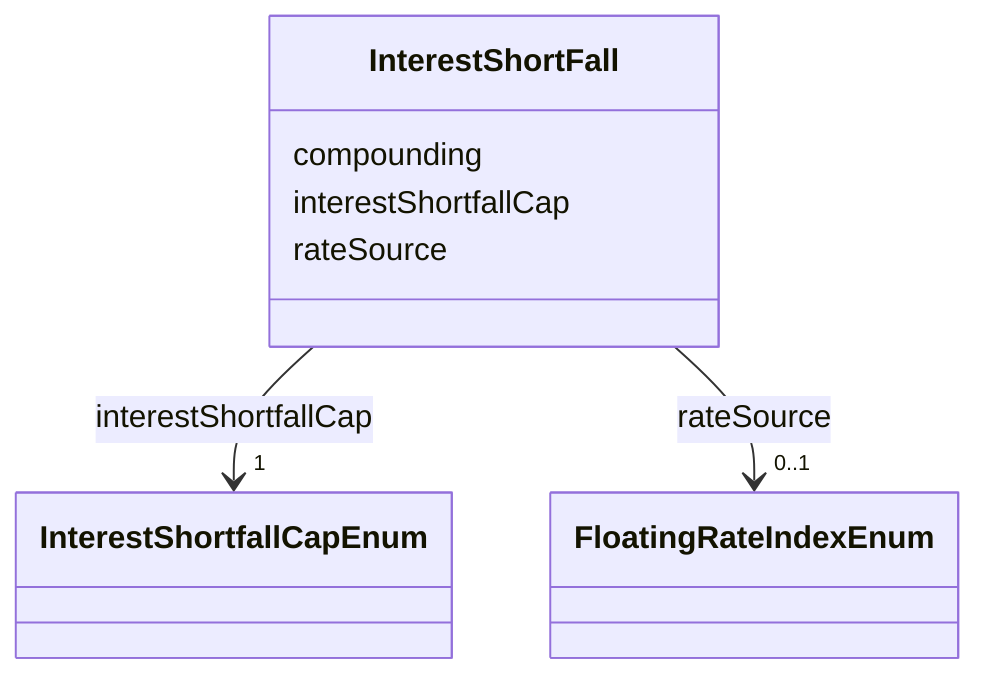

```mermaid
 classDiagram
    class InterestShortFall
    click InterestShortFall href "../InterestShortFall"
      InterestShortFall : compounding
        
      InterestShortFall : interestShortfallCap
        
          
    
        
        
        InterestShortFall --> "1" InterestShortfallCapEnum : interestShortfallCap
        click InterestShortfallCapEnum href "../InterestShortfallCapEnum"
    

        
      InterestShortFall : rateSource
        
          
    
        
        
        InterestShortFall --> "0..1" FloatingRateIndexEnum : rateSource
        click FloatingRateIndexEnum href "../FloatingRateIndexEnum"
    

        
      
```
