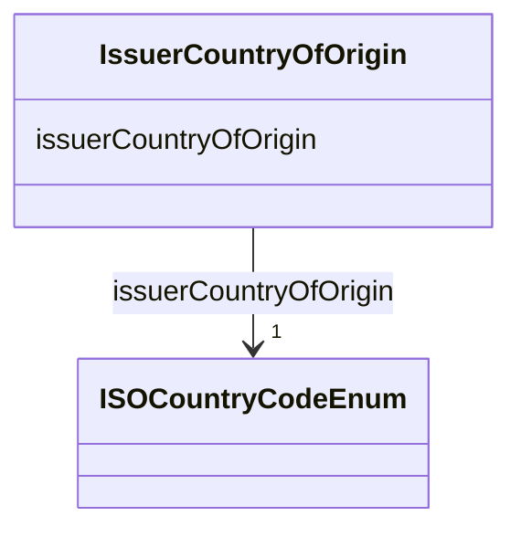

```mermaid
 classDiagram
    class IssuerCountryOfOrigin
    click IssuerCountryOfOrigin href "../IssuerCountryOfOrigin"
      IssuerCountryOfOrigin : issuerCountryOfOrigin
        
          
    
        
        
        IssuerCountryOfOrigin --> "1" ISOCountryCodeEnum : issuerCountryOfOrigin
        click ISOCountryCodeEnum href "../ISOCountryCodeEnum"
    

        
      
```
