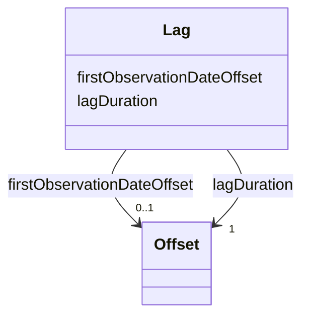

```mermaid
 classDiagram
    class Lag
    click Lag href "../Lag"
      Lag : firstObservationDateOffset
        
          
    
        
        
        Lag --> "0..1" Offset : firstObservationDateOffset
        click Offset href "../Offset"
    

        
      Lag : lagDuration
        
          
    
        
        
        Lag --> "1" Offset : lagDuration
        click Offset href "../Offset"
    

        
      
```
