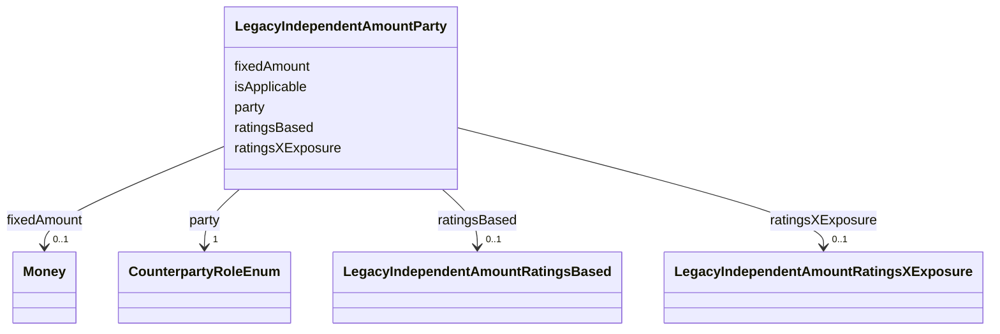

```mermaid
 classDiagram
    class LegacyIndependentAmountParty
    click LegacyIndependentAmountParty href "../LegacyIndependentAmountParty"
      LegacyIndependentAmountParty : fixedAmount
        
          
    
        
        
        LegacyIndependentAmountParty --> "0..1" Money : fixedAmount
        click Money href "../Money"
    

        
      LegacyIndependentAmountParty : isApplicable
        
      LegacyIndependentAmountParty : party
        
          
    
        
        
        LegacyIndependentAmountParty --> "1" CounterpartyRoleEnum : party
        click CounterpartyRoleEnum href "../CounterpartyRoleEnum"
    

        
      LegacyIndependentAmountParty : ratingsBased
        
          
    
        
        
        LegacyIndependentAmountParty --> "0..1" LegacyIndependentAmountRatingsBased : ratingsBased
        click LegacyIndependentAmountRatingsBased href "../LegacyIndependentAmountRatingsBased"
    

        
      LegacyIndependentAmountParty : ratingsXExposure
        
          
    
        
        
        LegacyIndependentAmountParty --> "0..1" LegacyIndependentAmountRatingsXExposure : ratingsXExposure
        click LegacyIndependentAmountRatingsXExposure href "../LegacyIndependentAmountRatingsXExposure"
    

        
      
```
