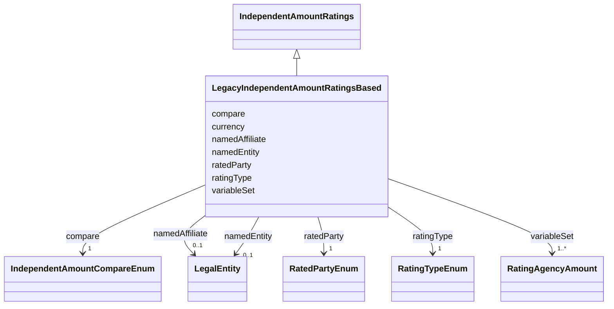

```mermaid
 classDiagram
    class LegacyIndependentAmountRatingsBased
    click LegacyIndependentAmountRatingsBased href "../LegacyIndependentAmountRatingsBased"
      IndependentAmountRatings <|-- LegacyIndependentAmountRatingsBased
        click IndependentAmountRatings href "../IndependentAmountRatings"
      
      LegacyIndependentAmountRatingsBased : compare
        
          
    
        
        
        LegacyIndependentAmountRatingsBased --> "1" IndependentAmountCompareEnum : compare
        click IndependentAmountCompareEnum href "../IndependentAmountCompareEnum"
    

        
      LegacyIndependentAmountRatingsBased : currency
        
      LegacyIndependentAmountRatingsBased : namedAffiliate
        
          
    
        
        
        LegacyIndependentAmountRatingsBased --> "0..1" LegalEntity : namedAffiliate
        click LegalEntity href "../LegalEntity"
    

        
      LegacyIndependentAmountRatingsBased : namedEntity
        
          
    
        
        
        LegacyIndependentAmountRatingsBased --> "0..1" LegalEntity : namedEntity
        click LegalEntity href "../LegalEntity"
    

        
      LegacyIndependentAmountRatingsBased : ratedParty
        
          
    
        
        
        LegacyIndependentAmountRatingsBased --> "1" RatedPartyEnum : ratedParty
        click RatedPartyEnum href "../RatedPartyEnum"
    

        
      LegacyIndependentAmountRatingsBased : ratingType
        
          
    
        
        
        LegacyIndependentAmountRatingsBased --> "1" RatingTypeEnum : ratingType
        click RatingTypeEnum href "../RatingTypeEnum"
    

        
      LegacyIndependentAmountRatingsBased : variableSet
        
          
    
        
        
        LegacyIndependentAmountRatingsBased --> "1..*" RatingAgencyAmount : variableSet
        click RatingAgencyAmount href "../RatingAgencyAmount"
    

        
      
```
